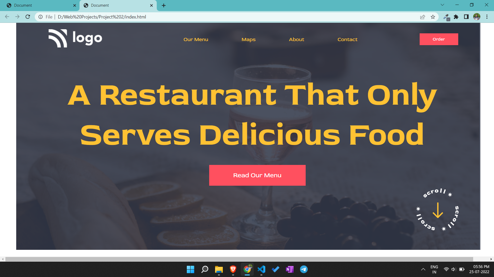

# Portfolio project 2

This is a one page portfolio template project made in HTML and CSS.

# Project live link

[Portfolio-project-2](https://bucolic-toffee-db6a87.netlify.app)

# Screenshot

# My learnings from this projects

- I learned about flex box and designing buttons.
- I learned about linear gradient in CSS.

# Time to finish the projecet

I took about 3 hours approximately to complete this project.
